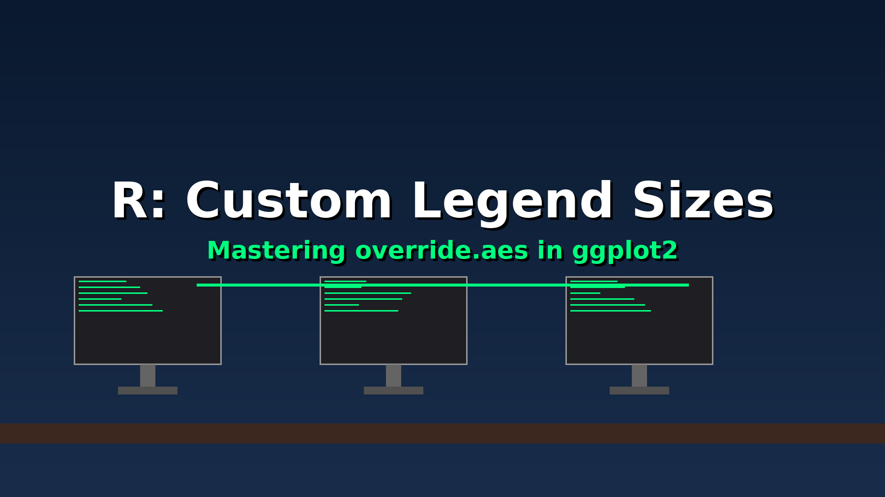

# 📊 ggplot2 Tip: Fix Tiny Legend Keys with override.aes

Ever reduced your point size to fix overplotting, only to realize your legend has become unreadable? 📉🔍

It's a common frustration in ggplot2: legend keys inherit the size of your data points by default. If your points are tiny, your legend symbols are tiny too.

The solution isn't to make your data points bigger (and ruin your plot!)—it's to use `override.aes` inside the `guides()` function.

In my latest post, I show you how to:

✅ Keep your data points small to avoid overplotting.

✅ Independently scale up your legend keys for perfect legibility.

✅ Use `guide_legend(override.aes = list(size = ...))` to master your plot aesthetics.

Stop squinting at your legends and start customizing them!

Read the full tip here: https://fortune9.netlify.app/2026/04/27/r-how-to-change-legend-key-size-in-ggplot2/

#RStats #DataViz #ggplot2 #DataScience #CodingTips #RProgramming #DataAnalytics